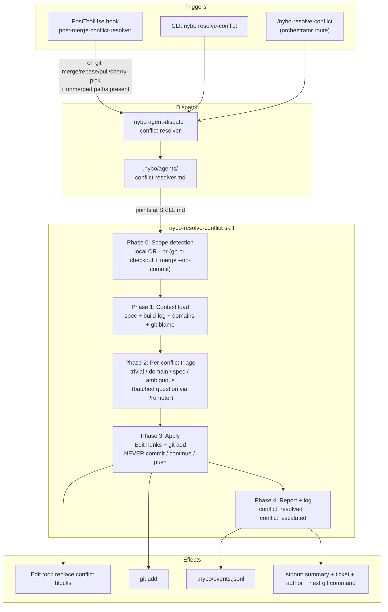
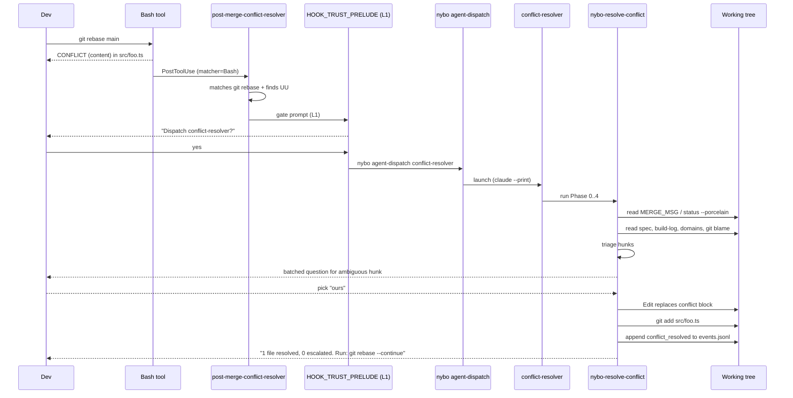

<!-- ⚠️ AUTO-GENERATED by nybo — do not edit directly -->
<!-- Source: .nybo/ — run `nybo doctor --fix` to regenerate -->


# nybo-resolve-conflict

Phase-driven workflow the `conflict-resolver` agent runs to turn `git merge` / `rebase` / `cherry-pick` / `pull` conflicts into spec-grounded, hunk-by-hunk resolutions. Triggered via the `post-merge-conflict-resolver` hook (auto), the `nybo resolve-conflict` CLI command, or the `/nybo-resolve-conflict` slash route.

## Phase 0 — Scope detection

1. If the dispatch context carries `pr: <n>`:
   - `gh pr checkout <n>` (errors abort the run with stderr captured + exit 1).
   - `gh pr view <n> --json baseRefName -q .baseRefName` to learn `<baseRef>`.
   - `git fetch origin <baseRef>`.
   - `git merge --no-commit --no-ff origin/<baseRef>` to surface conflicts.
2. Else (local mode):
   - Operation type: read `.git/MERGE_MSG`, `.git/REBASE_HEAD`, or `.git/CHERRY_PICK_HEAD` (whichever exists) to label `operation`.
3. Enumerate unmerged paths via `git status --porcelain` matching the regex `^(UU|AA|DD|DU|UD|AU|UA) `.
4. Empty result ⇒ append `conflict_resolver_no_conflicts` event with `details: { branch: "<current>" }` and exit silently.

## Phase 1 — Context load (cached once per run)

- Branch slug → feature: `git rev-parse --abbrev-ref HEAD` then match `/^(?:feat|fix)\/(.+)$/`. If no match, `feature: null` (Phase 4 handles).
- Spec dir: `docs/<feature>/spec/` (code profile) or `docs/<feature>/spec.md` (research profile) — read `status.yaml` profile field first.
- Build log: `docs/<feature>/feat/11-build-log.md` (code) or `docs/<feature>/11-build-log.md` (research).
- `status.yaml` fields: `ticket`, `action_type`, `created_by`.
- `.nybo/memory/CORE.md` and the list of `.nybo/memory/domains/*.md`.
- Per conflicted file: `git log --format='%an <%ae> %s' --left-right <ours>...<theirs> -- <file>` for blame context.

Cache the loaded context — never re-read inside Phase 2/3.

## Phase 2 — Per-conflict triage

For each conflicted file, parse hunks delimited by `<<<<<<<`, `=======`, `>>>>>>>` markers and classify each hunk into exactly one of:

| Class | Definition |
|---|---|
| `trivial` | Both sides add disjoint lines at the **exact** same insertion point with **zero** overlap. Strict — anything looser shifts to `ambiguous`. |
| `domain-coverable` | The conflicted file path matches a `key_files` entry from a loaded domain (`memory/domains/*.md`). The domain conventions disambiguate the winning side. |
| `spec-coverable` | The file appears in the spec task list, build-log "Files" section, or status.yaml task assignments. The spec narrative picks the side. |
| `ambiguous` | None of the above produces a confident resolution. |

Build **one** batched question payload covering every `ambiguous` hunk. Each entry includes: `file:line`, both sides' content, the spec passage / blame author available, and a suggested default. Invoke the `Prompter` interface (`src/services/interview/prompter.ts`) **exactly once** with the full payload — never per-hunk back-and-forth.

## Phase 3 — Apply

For each resolved hunk (trivial / domain / spec / answered), use the `Edit` tool to replace the **entire** conflict block (`<<<<<<<` through `>>>>>>>` markers and content) with the chosen text. Escalated hunks (binary / delete-vs-modify / security / >5-file run) leave conflict markers untouched.

After all hunks in a single file resolve cleanly, run `git add <file>`.

**Refuse list — the agent must NEVER invoke any of:**

- `git commit` (any flag)
- `git rebase --continue`
- `git merge --continue`
- `git cherry-pick --continue`
- `git push` (any flag)

The merge commit always belongs to the human. Phase 3 ends at `git add` for resolved files only.

## Phase 4 — Report + log

Print a summary line: `N resolved, M escalated, K files staged`.

If the spec context loaded in Phase 1 carried `feature`, prepend a context block:

```
Spec: <feature> · Ticket: <ticket-or-null> · Author: @<created_by-or-anonymous>
```

Otherwise: `No spec context found for branch <branch> — resolutions used domain conventions only.`

Tell the human the exact follow-up command for the operation: `git rebase --continue`, `git merge --continue`, `git cherry-pick --continue`, or `git commit`.

Append events to `.nybo/events.jsonl` via the `logEvent` helper (`src/services/event-logger.ts`):

- Any successful run (≥1 file staged): `conflict_resolved` with `details: { feature, files_resolved, files_escalated, operation, pr_number? }`.
- Full-escalation run (no hunks resolved): `conflict_escalated` with `details: { feature, reason, files }`.
- Empty run from Phase 0: already logged as `conflict_resolver_no_conflicts`.

These three event types are observability-only — never feed trust promotion criteria (see `.nybo/memory/domains/trust.md`, "Conflict resolution events").

## Phase flow (Mermaid)



## Sequence — local conflict via hook (L1 supervised)



## Out of scope

- `git stash` conflicts.
- Auto-continue (`git rebase --continue`, `git commit`) — explicit non-goal carried into Phase 3 refuse list.
- Binary-file resolution (escalated immediately at Phase 2).
- Large-conflict batching beyond the >5-file escalation threshold.
- Approving / merging PRs (only humans approve).


## Project Context

- **CORE.md**: `.nybo/memory/CORE.md`
- **Domain files**: `.nybo/foundation/domains.yaml`
- **Design principles**: —
- **Workflow skills**: solid, cqrs, clean-code, pattern-discover, nybo-plan, nybo-run, nybo-verify, nybo-pr, nybo-ship, nybo-build-log, nybo-sync-pr, nybo-curate, nybo-tdd, nybo-worktree, nybo-simplify, nybo-batch, nybo-insights, nybo-session-summary, nybo-resolve-conflict, nybo-critique, nybo-reconcile, nybo-workflow-digest, nybo-fix-yaml, nybo-design
- **Project pattern skills**: `.nybo/skills/` (populated after features ship)
