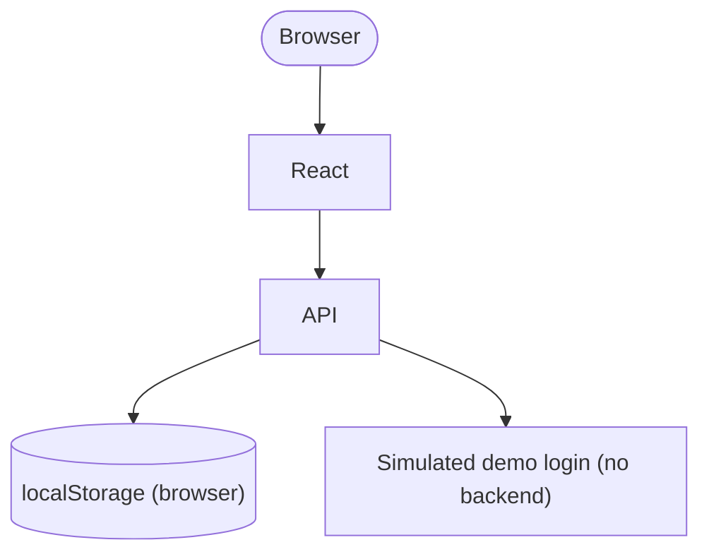
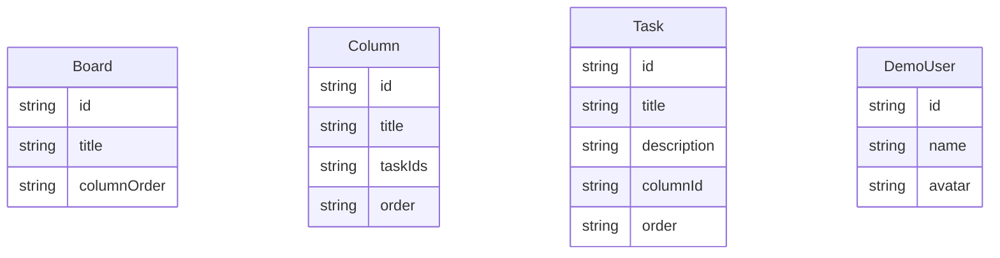

# Architecture — kanban-demo

## Stack

## Data Model

## Key Decisions

- File structure: feature-based
- Error handling: Result pattern
- Auth model: Auth model: Simulated demo login with no backend. Login accepts a one-click demo button or displayed demo credentials; a session flag is stored in localStorage. No real credential validation occurs.
