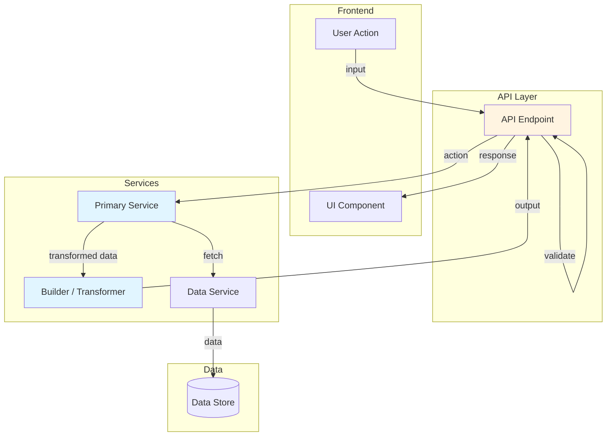
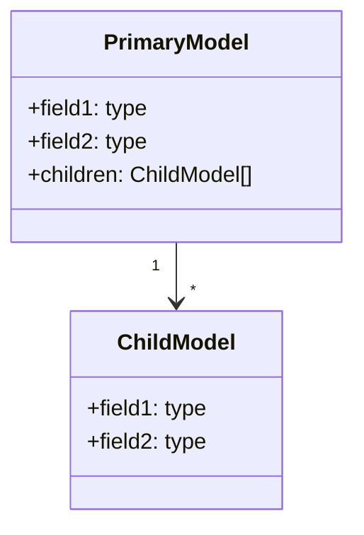
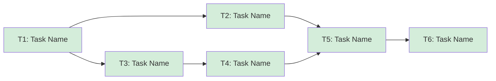

# {Feature Name} - Overview

## Spec Reference

[Spec](../../spec/{feature}/spec.md)

## Problem + Solution

- {1-2 lines describing the current pain point or business need}
- Solution: {1-2 lines describing what will be built}
- {Key technical approach — services, patterns, integrations used}
- {Output format or deliverable — what the user gets}

## Architecture Diagram

## Data Model

{Describe whether new database entities are required or if existing data is reused.}

**Key Data Structures:**

## Task Index

| Task | File | Description | Dependencies |
|------|------|-------------|--------------|
| T1 | [01-plan-01-{task-name}.md](./01-plan-01-{task-name}.md) | {Brief description} | None |
| T2 | [01-plan-02-{task-name}.md](./01-plan-02-{task-name}.md) | {Brief description} | T1 |
| T3 | [01-plan-03-{task-name}.md](./01-plan-03-{task-name}.md) | {Brief description} | T1 |
| T4 | [01-plan-04-{task-name}.md](./01-plan-04-{task-name}.md) | {Brief description} | T3 |
| T5 | [01-plan-05-{task-name}.md](./01-plan-05-{task-name}.md) | {Brief description} | T2, T4 |
| T6 | [01-plan-06-{task-name}.md](./01-plan-06-{task-name}.md) | {Brief description} | T5 |

## Dependency Graph

