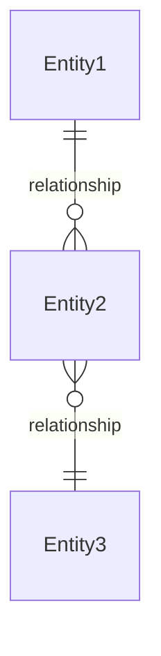
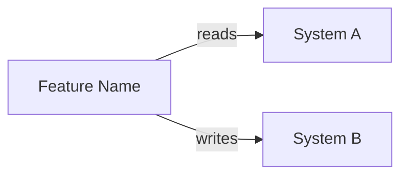

# {Feature Name} — Software Design Document

## Source

Business requirements, feature breakdown (F-xx), acceptance criteria (AC-xxx), business rules (BR-xxx), and screen descriptions (SCR-xxx) live in [requirement.md](./requirement.md). This SDD focuses on the engineering design and implementation contract.

---

## Intention

{1-2 sentences: what the feature does, who uses it, and the business outcome. Focus on the "what" and "why", not the "how".}

{Example: The Planner creates or edits the capacity plan for their team within a flexible period. The system enforces allocation limits in real time and preloads HR-approved leaves automatically.}

---

## Use Cases

Detailed scenarios in [use-cases.md](./use-cases.md).

| Use Case | Description | AC refs |
|----------|-------------|---------|
| [UC-01 — {Title}](./use-cases.md#uc-01--use-case-title) | {What the actor does} | AC-001, AC-002 |
| [UC-02 — {Title}](./use-cases.md#uc-02--use-case-title) | {What the actor does} | AC-003 |

---

## Technical Requirements

Implementation constraints not captured in the product requirement. Omit this section if all constraints are already in requirement.md.

| ID | Category | Requirement |
|----|----------|-------------|
| NFR-T01 | Build | {e.g., "Bundle size increase must be < 10 KB gzipped"} |
| NFR-T02 | Coverage | {e.g., "New service logic must reach ≥ 80% branch coverage"} |
| NFR-T03 | Compatibility | {e.g., "Must work with Node 18 and 20"} |

---

## Test Cases

Each test case references an AC from [requirement.md](./requirement.md) and follows Given/When/Then format.

### TC-001 — {Test title} (AC-001)

**Given** {precondition}
**When** {action}
**Then** {expected result}

### TC-002 — {Test title} (AC-002, BR-001)

**Given** {precondition}
**When** {action}
**Then** {expected result}

---

## Architecture

Technical architecture constraints, data model, API contracts, and service integrations that shape the implementation. **Delete any subsection that doesn't apply — empty tables add noise.**

### Architecture Decision Records

| ADR | Title | Impact on this feature |
|-----|-------|----------------------|
| {ADR-NNN} | {Decision title} | {How this ADR constrains or shapes the feature} |

### Tradeoffs

| Tradeoff | We chose | Over | Rationale |
|----------|----------|------|-----------|
| {e.g., "Consistency vs. Latency"} | {What was prioritized} | {What was sacrificed} | {Why} |

### Data Model

{Key entities, relationships, and constraints relevant to this feature. Omit if no data model changes.}

| Entity | Key Fields | Notes |
|--------|-----------|-------|
| {Entity1} | {field1, field2} | {Constraints or notes} |

### API / Data Contracts

| Endpoint / Contract | Method | Description |
|---------------------|--------|-------------|
| `/api/v1/resource` | GET / POST | {What this endpoint does} |
| `/api/v1/resource/:id` | GET / PUT / DELETE | {What this endpoint does} |

### Service Integrations

| System | Direction | Data |
|--------|-----------|------|
| {System Name} | Reading | {What data is consumed} |
| {System Name} | Writing | {What data is sent} |

