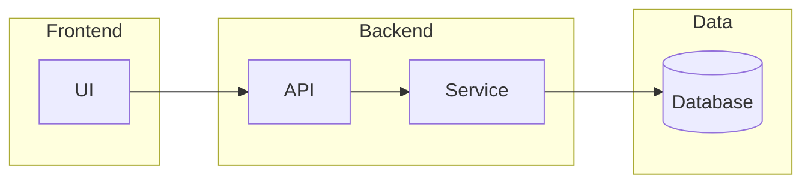
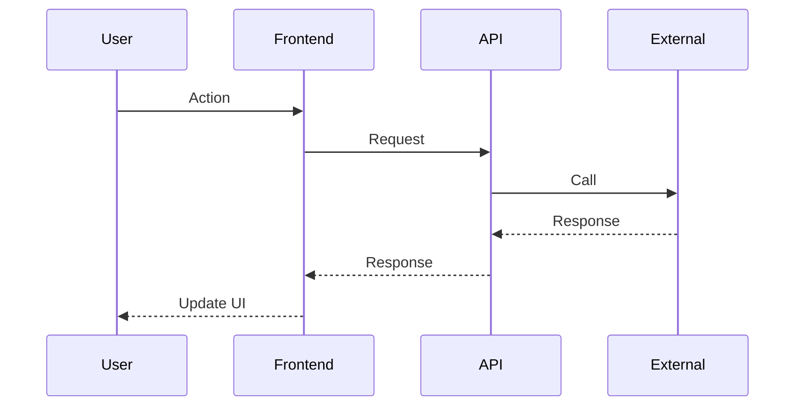
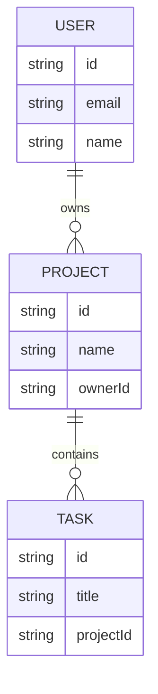
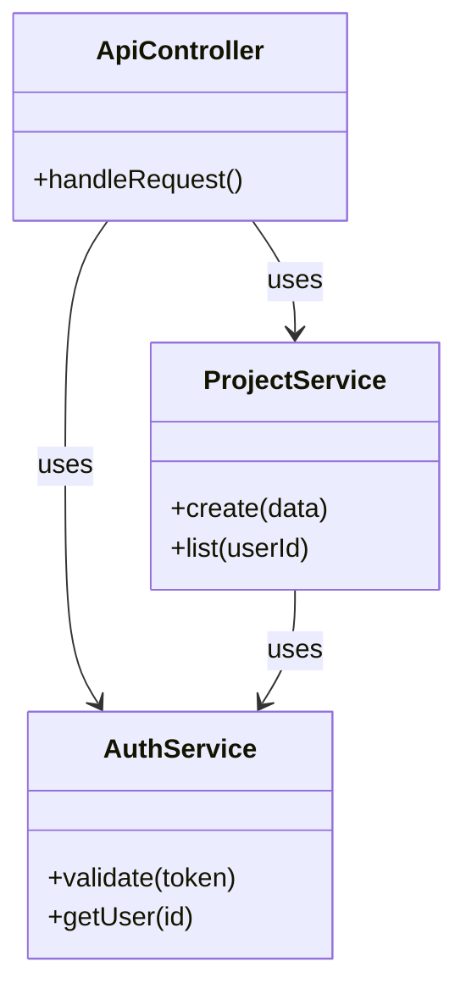

# Mermaid diagram examples

Use these patterns in specs for architecture, flows, and data. Pick the diagram type that best fits the section.

---

## Flowchart — feature architecture and data flow

**Use this when:** Showing how components connect, where data goes, or high-level feature flow.

---

## Sequence diagram — multi-step or multi-actor interactions

**Use this when:** Describing a flow over time between user, frontend, API, and external services.

---

## ER diagram — new or changed data models

**Use this when:** Introducing or changing entities, tables, or core domain models.

---

## Class diagram — service and component relationships

**Use this when:** Describing service boundaries, interfaces, or component dependencies.

