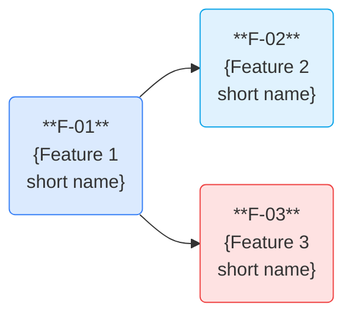
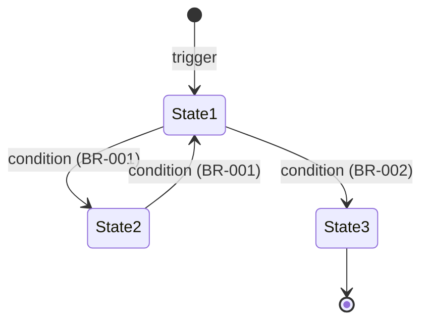
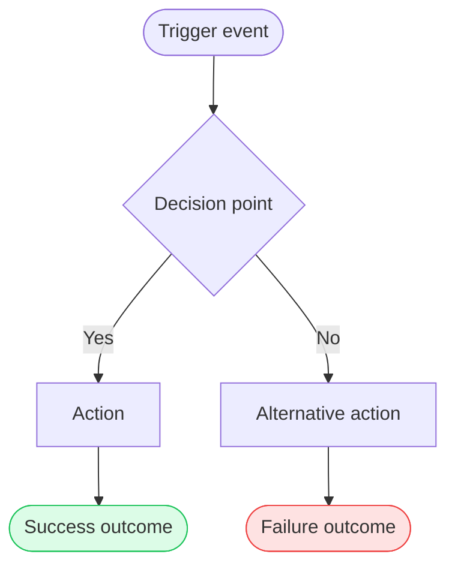
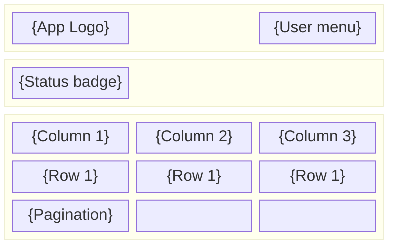
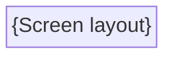

# {Product Name} — {Requirement Name}
## Feature Breakdown by Deliverable

**Version:** {Semantic version — e.g., "1.0.0"}
**Project:** {Project code — e.g., "PRJ-2026-001"}
**Date:** {Month Year — e.g., "April 2026"}
**Owner:** {Product owner or responsible person}

---

## Table of Contents

1. [Requirement Overview](#1-requirement-overview)
2. [Feature Dependency Map](#2-feature-dependency-map)
3. [Detailed Features](#3-detailed-features)
4. [Non-Functional Requirements](#4-non-functional-requirements)
5. [UI/UX — Screen Descriptions](#5-uiux--screen-descriptions)
6. [Flags and Pending Items](#6-flags-and-pending-items)

---

## 1. Requirement Overview

> Describe the requirement in 2-3 sentences: what capability it adds, what problem it solves, and the scope boundary.

{Example: The **Consumption Control** requirement adds a full lifecycle management system for monthly document processing plans. It covers visibility for tenants, plan management for admins, and automated enforcement of usage limits.}

| Axis | What it solves | For whom |
|---|---|---|
| {e.g., "Visibility"} | {e.g., "The tenant can see real-time consumption and remaining days"} | {e.g., "Admin Tenant"} |
| {e.g., "Management"} | {e.g., "Admins can create, edit, and deactivate plans"} | {e.g., "Admin"} |
| {e.g., "Automation"} | {e.g., "The system counts usage, applies limits, and sends alerts automatically"} | {e.g., "System"} |

---

## 2. Feature Dependency Map

> **Skip this section if there is only one feature.**
> Color-code by category (blue = foundation, red = enforcement, yellow = alerts, green = lifecycle, purple = visibility).
> Aim for 1-2 features per spec. 3 features is a strong signal to split into sibling specs — wire `dependencies.blocking/blocks` in status.yaml.



### Critical Path and Delivery Order

> **Gantt:** include only if features have real parallel delivery time constraints. Skip otherwise.

```mermaid
gantt
    title Critical Path — {Requirement Name}
    dateFormat  YYYY-MM-DD
    axisFormat  Sprint %W

    section Critical path
    F-01 {Feature Name}   :crit, s1a, {start-date}, 7d
    F-02 {Feature Name}   :crit, s1b, after s1a, 7d

    section Features with float
    F-03 {Feature Name}   :s2a, after s1a, 7d
```

| Feature | Critical Path | Depends on | Can be developed in parallel with |
|---|---|---|---|
| F-01 {Name} | **CP** | — (base) | F-02 |
| F-02 {Name} | **CP** | F-01 | F-03 |
| F-03 {Name} | | F-01 | F-02 |

**Critical-path length:** {e.g., "2 features in 2 sequential sprints"}

Features with float: {e.g., "F-03 — can be developed in parallel without affecting the delivery date."}

---

## 3. Detailed Features

> Each feature is the source of truth that feeds the SDD — see [spec.md](./spec.md).
> Structure: Description · Actor/Priority/Screen · Business Rules (BR-xxx) · Acceptance Criteria (AC-xxx) · optional State/Flow diagrams · optional Exception Scenarios.

---

### F-01: {Feature Name} ({Actor})

**Description**
{What the feature does and the business outcome, in 2-3 sentences. Be specific about what the user sees or the system does.}

**Actor:** {e.g., "Admin Tenant" / "System (automated process)"}
**Priority:** {Must / Should / Could}
**Screen:** {e.g., "SCR-001" — or "—" for backend/automated features}

#### Business Rules

| ID | Rule |
|---|---|
| BR-001 | {Behavioral constraint — e.g., "The grid is read-only. The Admin cannot edit, create, or delete any data."} |
| BR-002 | {e.g., "Alert icon activates when period consumption reaches the configured threshold."} |

> Each rule must be testable. Use formulas when the rule involves calculations. Reference rules by ID (BR-xxx) across features when the same rule applies.

#### Acceptance Criteria

| ID | Criterion | Expected Result |
|---|---|---|
| AC-001 | {What is being verified — e.g., "Admin sees tenant status and period grid with current and remaining consumption"} | {Pass condition — e.g., "PASS: data visible and correct"} |
| AC-002 | {e.g., "Grid sorted descending by period start date"} | {e.g., "PASS: most recent period appears first"} |

#### State Diagram (optional)

> **Skip if not applicable.** Include only when the feature has ≥ 3 distinct states with named transitions.



#### Flow Diagram (optional)

> **Skip if not applicable.** Include only when the feature involves a multi-step automated process (≥ 4 steps). Color terminal states: green = success, red = failure.



#### Exception Scenarios (optional — security, financial, or compliance domains only)

| | |
|---|---|
| Situation | {What goes wrong — e.g., "Email service unavailable during the blocking process"} |
| What DOES happen | {e.g., "Block is applied; email is queued for retry; error is logged"} |
| What does NOT happen | {e.g., "Block is not reverted due to email failure; notification is not lost"} |

---

### F-02: {Feature Name} ({Actor})

**Description**
{...}

**Actor:** {...}
**Priority:** {...}
**Screen:** {...}

#### Business Rules

| ID | Rule |
|---|---|
| BR-xxx | {...} |

#### Acceptance Criteria

| ID | Criterion | Expected Result |
|---|---|---|
| AC-xxx | {...} | {...} |

---

### F-03: {Feature Name} ({Actor})

**Description**
{...}

**Actor:** {...}
**Priority:** {...}
**Screen:** {...}

#### Business Rules

| ID | Rule |
|---|---|
| BR-xxx | {...} |

#### Acceptance Criteria

| ID | Criterion | Expected Result |
|---|---|---|
| AC-xxx | {...} | {...} |

---

> A feature may have multiple specs. If this spec has grown beyond 2 features, split it — each spec should be atomic, independently reviewable, and implementable in isolation. Wire `dependencies.blocking / blocks` in each status.yaml.

---

## 4. Non-Functional Requirements

> **Skip this section if all constraints are standard** (latency/security covered by global NFRs). Include only non-obvious, feature-specific thresholds.
> Apply transversally across all features. Each NFR must have a measurable threshold and a measurement condition.

| ID | Category | Description | Threshold | Measurement Condition |
|---|---|---|---|---|
| NFR-001 | Performance | {e.g., "Page counting must not add perceptible latency"} | {e.g., "p95 ≤ 50ms additional over base"} | {e.g., "Normal processing in production"} |
| NFR-002 | Availability | {e.g., "Daily renewal process must be reliable"} | {e.g., "99.9% scheduler uptime"} | {e.g., "Critical daily execution"} |
| NFR-003 | Security | {e.g., "Tenant can only view their own data"} | {e.g., "0 unauthorized accesses"} | {e.g., "Existing RBAC applied to new screens"} |
| NFR-004 | Usability | {e.g., "Blocking feedback must be immediate"} | {e.g., "< 5s between cap reached and user seeing block"} | {e.g., "Active user in UI at time of blocking"} |

---

## 5. UI/UX — Screen Descriptions

> **Skip this section entirely if this spec has no UI changes** (backend, API-only, or CLI features).
> A working prototype is required before this requirement moves to implementation.
> Prototype must be a Figma file (preferred) or a static HTML file. Mermaid wireframes are a structural reference only.

| | |
|---|---|
| **Prototype type** | {Figma / HTML} |
| **Prototype link** | {URL or relative path — e.g., "https://figma.com/file/xxx"} |
| **Prototype status** | {Draft / Review / Approved} |

---

### SCR-001: {Screen Name} ({Actor})

**Access:** {Navigation path — e.g., "User menu → option 'Plan y consumo'."}

**Purpose:** {One sentence — what the screen enables.}

#### Wireframe — SCR-001



#### Visual Description

**{Zone Name} — {Zone Purpose}**

{Describe layout, key elements, and behavior. Include state variations (active, blocked, empty, error) and visual cues (colors, icons, tooltips).}

| Column | Visual Description |
|---|---|
| {Column name} | {What it shows and how} |
| {Column name} | {e.g., "Remaining consumption. If 0 or negative, shown in red bold."} |

**Empty and error states:**
- No data: {e.g., "No periods configured. Contact your representative."}
- Loading error: {e.g., "Error toast with retry option."}

---

### SCR-002: {Screen Name} ({Actor})

**Access:** {...}

**Purpose:** {...}

#### Wireframe — SCR-002



#### Visual Description

{...}

---

## 6. Flags and Pending Items

> **Skip this section if no blocking items exist.**
> Items that must be resolved **before development starts**. Remove flags as they are resolved.

### Mandatory gate: Working prototype

> This requirement cannot move to implementation without an approved working prototype.

| Flag | Description | Responsible | Blocks |
|---|---|---|---|
| ⚠ Working prototype | {e.g., "Figma prototype pending approval for SCR-001 and SCR-002"} | {e.g., "Design"} | {e.g., "All features with UI"} |
| ⚠ {Short name} | {What is missing or undecided} | {Team or person} | {Feature IDs — e.g., "F-01, F-02"} |

---

*This document is the product input for the SDD — see [spec.md](./spec.md) for the Software Design Document.*
