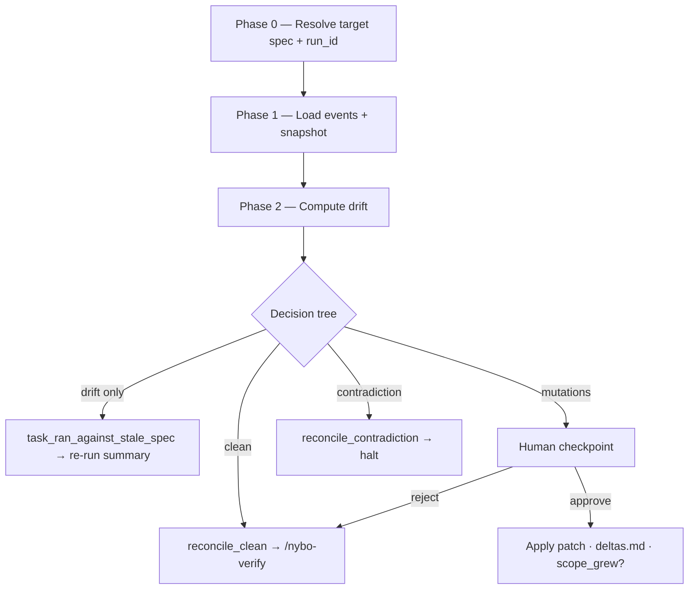

# nybo-reconcile

After a parallel run merges (code-level reconciliation handled by the `parallel-reconciliation-protocol` worktree-merger), the SPEC may have drifted from reality. Workers may have run against a stale `spec.md` hash, proposed spec mutations mid-run, or revealed gaps that need formal scope expansion. This skill is the sole writer of `spec.md` post-run.

## Inputs

- Positional: `<feature>` — the spec slug under `docs/<feature>/`.
- Optional: `--run-id=<uuid>` — pins reconciliation to a specific parallel-run cohort. Defaults to the most recent `run_id` observed in `events.jsonl` for the feature.
- Optional: `--yes` — auto-accepts non-contradictory mutations (intended for `autonomous` trust only).

## Phase 0 — Resolve target spec + run_id

- Read `docs/<feature>/spec/spec.md`, `docs/<feature>/status.yaml`, and `docs/<feature>/run-plan.json` (v2 schema).
- If `--run-id` is omitted, scan `events.jsonl` tail for the most recent `task_end` event whose `details.feature === <feature>` and lift `details.run_id`.
- If no `run_id` is resolvable, exit silently with a no-op message — sequential runs have no events to join on; reconcile is a no-op for them.

## Phase 1 — Load events + compute final snapshot hash

- Compute `finalSpecHash = sha256(docs/<feature>/spec/spec.md content)` via `node:crypto`.
- Read `.nybo/events.jsonl`, filter to events whose `details.run_id` matches the target cohort, preserve emission order.

## Phase 2 — Compute drift (call into reconciler service)

- Delegate to `reconcile()` in `src/services/reconcile/reconciler.ts`.
- Service returns one of four outcomes: `clean`, `drift_only`, `needs_human`, or `halt`.

## Phase 3 — Decision tree

1. **`clean`** — `staleTasks` empty AND `mutations` empty:
   - Emit `reconcile_clean` event (actor `agent`).
   - Write `docs/<feature>/reconcile-report.md` with the "no drift detected" body.
   - Emit terminal `spec_reconciled` event.
   - Stop message: "Reconcile complete for `<slug>`. Next: `/nybo-verify <slug>`".

2. **`drift_only`** — stale snapshot but no mutations:
   - Emit one `task_ran_against_stale_spec` event per stale `task_id`.
   - Write report with "Tasks needing re-run" section listing each `task_id`.
   - Emit terminal `spec_reconciled` event.
   - Stop message: "Drift detected: tasks <ids> need re-run. Re-dispatch via `/nybo-run`."

3. **`needs_human`** — non-contradictory mutations exist:
   - Present the mutation batch (one row per `MutationProposal`: `task_id`, `severity`, `rationale`, `proposed_diff` summary).
   - For each mutation, the human approves or rejects (in `--yes` mode, all non-contradictory mutations auto-accept).
   - For each accepted mutation: apply patch to `spec.md` (direct write OR `/nybo-plan edit` dispatch when scope expansion is needed), append a `### <timestamp> — <task_id>` block to `docs/<feature>/deltas.md` (create if absent).
   - When accepted mutations spawn new tasks: write `docs/<feature>/feat/01-plan-NN-reconcile-<slug>.md` files and emit `reconcile_scope_grew`.
   - Emit terminal `spec_reconciled` event.

4. **`halt`** — contradictory mutations detected (two events target the same `BR-` or `AC-` id with different diffs):
   - Emit `reconcile_contradiction` event including both `task_id`s and the conflicting target.
   - Write halt-flavored report (do NOT emit `spec_reconciled`).
   - Stop message: "Reconcile halted: contradiction detected. Resolve manually before re-running."

## Output artifacts (every non-no-op invocation)

- `docs/<feature>/reconcile-report.md` — markdown body composed by the `report-renderer` pure function.
- `docs/<feature>/deltas.md` — append-only ledger of accepted mutations (created on first append).
- `docs/<feature>/feat/01-plan-NN-reconcile-<slug>.md` — only when accepted mutations expand scope.

## Events emitted

Per decision-tree leaf the skill emits ONE leaf event (`reconcile_clean` / `reconcile_scope_grew` / `reconcile_contradiction`) plus a terminal `spec_reconciled` event when the phase closes successfully. Halt path emits ONLY `reconcile_contradiction` (no terminal).

Every event MUST carry `details.run_id` and `details.feature` so downstream readers (dashboard, hub) can join on the cohort.

## Pattern A enforcement

Workers cannot write to `spec.md` during a run — they emit `spec_mutation_proposed` events with `rationale`, `proposed_diff`, and `severity`. The reconciler is the SOLE writer of `spec.md` post-run. This skill body is the on-disk record of that contract.

## Dispatch pattern

Per the `nybo-agentic-dispatch` rule of three (workflows.md), the CLI command `nybo reconcile <feature>` gathers the JSON context (events, mutations, spec hashes) and pipes it to this subagent via `claude --print --stdin`. The reconciler service in `src/services/reconcile/` is the pure compute layer; this skill is the workflow narrative + I/O contract.

## Lifecycle position

Canonical 5-phase order remains `plan → run → verify → curate → ship` for sequential runs. When parallel run is used, the order becomes `plan → run → reconcile → verify → curate → ship`. The `/nybo-verify` skill MUST NOT advance status to `verified` until `/nybo-reconcile` has emitted `reconcile_clean` OR `spec_reconciled` for the latest `run_id` (when parallel was used). Sequential runs skip this phase entirely (Phase 0 exits silently).
