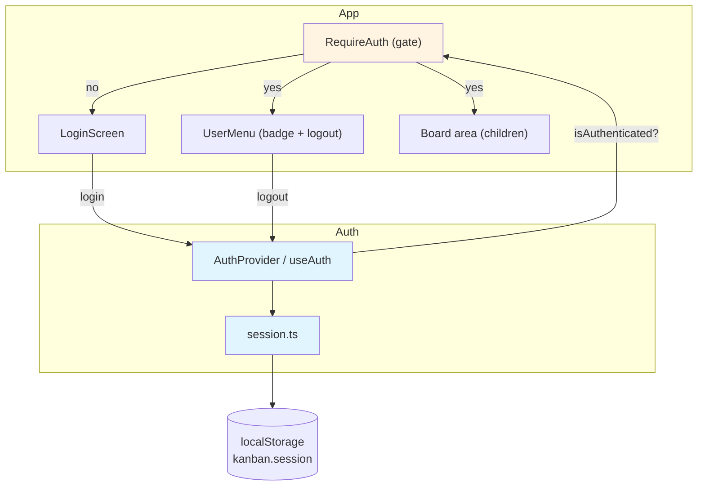
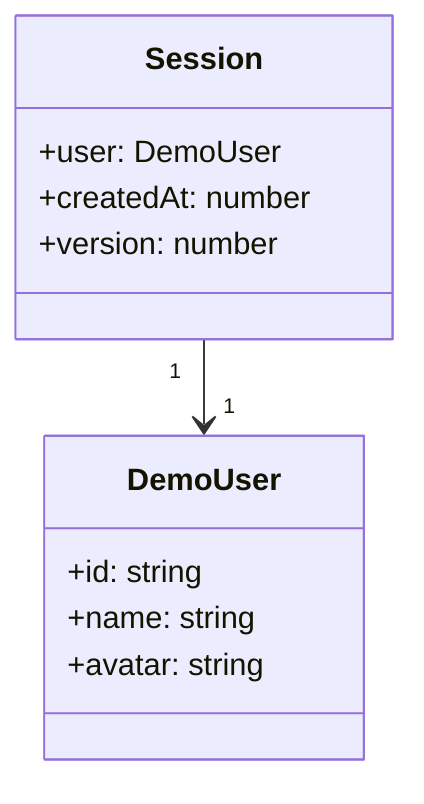
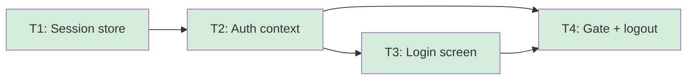

# Demo Authentication & Session - Overview

## Spec Reference

[Spec](../spec/spec.md) · [Requirement](../spec/requirement.md)

## Problem + Solution

- The demo lands straight on a board, which doesn't read like a real product and
  gives no clean "log out / replay" gesture.
- Solution: a simulated login gate — one-click or `demo / demo` — that persists a
  session to `localStorage` and surfaces the signed-in user.
- Technical approach: a `src/auth/` module — session storage helper, React
  `AuthProvider` + `useAuth` (single source of truth), a `LoginScreen`, and a
  `RequireAuth` gate that renders the board area when authenticated.
- Output: a polished sign-in → board → reload → logout flow with no backend.

## Architecture Diagram

## Data Model

No DB. One static `DEMO_USER` constant and a `Session` persisted to
`localStorage` under `kanban.session` (separate from the board-data key
`kanban.board`).

## Task Index

| Task | File | Description | Dependencies |
|------|------|-------------|--------------|
| T1 | [01-plan-01-session-store.md](./01-plan-01-session-store.md) | Types, demo constants, and the session storage helper (read/write/clear with corrupt-state fallback) | None |
| T2 | [01-plan-02-auth-context.md](./01-plan-02-auth-context.md) | `AuthProvider` + `useAuth` — auth state, login/logout, hydrate from session | T1 |
| T3 | [01-plan-03-login-screen.md](./01-plan-03-login-screen.md) | `LoginScreen` — one-click + prefilled credential form, responsive | T2 |
| T4 | [01-plan-04-route-gate-logout.md](./01-plan-04-route-gate-logout.md) | `RequireAuth` gate, `UserMenu` (badge + logout), App wiring | T2, T3 |

## Dependency Graph

