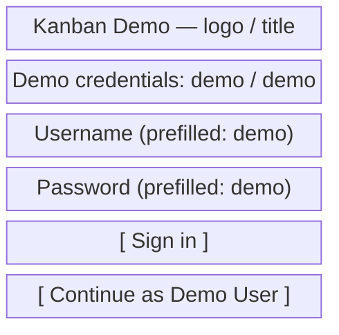

# Kanban Demo — Demo Authentication & Session

**Version:** 1.0.0
**Project:** kanban-demo
**Date:** June 2026
**Owner:** Demo

---

## 1. Requirement Overview

The **Demo Authentication** requirement adds a simulated login gate so the demo
reads like a real app without any backend. A visitor signs in as the demo user
(one click or `demo / demo`), the session persists in `localStorage`, and a
reload keeps them on the board. Logging out returns to the login screen and
never touches board data.

| Axis | What it solves | For whom |
|---|---|---|
| Gating | Unauthenticated users see a login screen, not the board | Visitor |
| Sign-in | One-click or demo-credential login, no real auth | Visitor |
| Session | Reload stays signed in via `localStorage` | Demo User |
| Sign-out | Log out clears the session; board data survives | Demo User |

---

## 3. Detailed Features

### F-01: Demo Authentication & Session (Visitor / Demo User)

**Description**
A simulated login screen gates the app. Sign-in is one-click ("Continue as Demo
User") or via a `demo / demo` credential form. A successful sign-in persists a
session to `localStorage`, shows the board, and surfaces "Logged in as Demo
User" context. Log out clears the session only.

**Actor:** Visitor (pre-auth) / Demo User (post-auth)
**Priority:** Must
**Screen:** SCR-001

#### Business Rules

| ID | Rule |
|---|---|
| BR-001 | An unauthenticated user is shown the login screen; the board never renders without a session. (FR-L1) |
| BR-002 | Login is simulated — a one-click "Continue as Demo User" button and a username/password form that accepts the demo credentials. No network call. (FR-L2) |
| BR-003 | Demo credentials (`demo` / `demo`) are pre-filled and visibly displayed on the login screen. (FR-L3) |
| BR-004 | The credential form accepts only the demo credentials; any other input shows an inline error and does not sign in. (FR-L2) |
| BR-005 | A successful sign-in writes a session to `localStorage` under a dedicated session key, separate from board data. (FR-L4) |
| BR-006 | On launch, a valid persisted session auto-signs-in and lands on the board. (FR-L4) |
| BR-007 | Log out clears only the session key; board-data storage is never read or deleted. (FR-L5) |
| BR-008 | After sign-in the demo user's name and avatar ("Logged in as Demo User") are displayed. (FR-L6) |
| BR-009 | A missing or corrupt session value degrades to the login screen — never crashes. (NFR-4) |

#### Acceptance Criteria

| ID | Criterion | Expected Result |
|---|---|---|
| AC-001 | First load, no session | PASS: login screen visible, board not rendered (FR-L1) |
| AC-002 | Click "Continue as Demo User" | PASS: lands on the board (FR-L2) |
| AC-003 | Submit pre-filled `demo / demo` | PASS: lands on the board (FR-L2, FR-L3) |
| AC-004 | Submit wrong credentials | PASS: inline error, stays on login (FR-L2) |
| AC-005 | Reload after sign-in | PASS: still signed in, board shown (FR-L4) |
| AC-006 | Click Log out | PASS: returns to login screen (FR-L5) |
| AC-007 | Log out then sign back in | PASS: board data unchanged (invariant) (FR-L5) |
| AC-008 | After sign-in | PASS: "Logged in as Demo User" + avatar visible (FR-L6) |
| AC-009 | Corrupt session value in `localStorage` | PASS: falls back to login, no crash (NFR-4) |
| AC-010 | Login at 320px–desktop | PASS: usable, touch-friendly targets (NFR-3) |

---

## 4. Non-Functional Requirements

| ID | Category | Description | Threshold | Measurement Condition |
|---|---|---|---|---|
| NFR-1 | Zero setup | Login runs as a static frontend, no server/config | 0 backend calls on the login path | Cold open of the built app |
| NFR-3 | Responsiveness | Login screen usable on mobile and desktop | 320px–1440px, touch targets ≥ 44px | Manual resize / device emulation |

---

## 5. UI/UX — Screen Descriptions

### SCR-001: Login Screen (Visitor)

**Access:** App launch when no valid session exists.
**Purpose:** Let a visitor sign in as the demo user in one click or with `demo / demo`.

#### Wireframe — SCR-001

#### Visual Description

A single centered card: brand title, a visible credential hint, a username +
password form pre-filled with `demo` / `demo`, a primary "Sign in" button, and a
prominent "Continue as Demo User" one-click button. Wrong credentials show an
inline error below the form. Fully responsive; touch-friendly controls.

**Empty and error states:**
- Wrong credentials: inline error — "Use demo / demo (or click Continue as Demo User)."

---

## 6. Flags and Pending Items

None — scope is fully resolved by `requirements.md` §9 (Resolved Decisions) and
the Assumptions section of [spec.md](./spec.md).

---

*Product input for the SDD — see [spec.md](./spec.md).*
