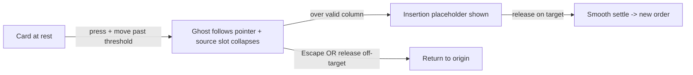

# Requirement — Drag & Drop (PRD)

> Source scope: project `requirements.md` §4.4 (FR-D1..D8), §5 (NFR-2/3/5), §6.
> Out of scope here: board rendering & task CRUD (`kanban-board`), persistence
> (`persistence-seed`), auth (`demo-auth`).

## S1 — Overview

The core showcase of the demo: pick up a task card and drop it at a new position
within a column or in another column, with a live ghost preview, an insertion
indicator, a smooth settle, and full mouse + touch support. Every drop is a single
atomic state change; no drop or cancel may ever duplicate or lose a task.

| Axis | Value |
|------|-------|
| What | Reorder / move task cards by dragging |
| For whom | The demo user on the Kanban board |
| Surface | Board UI (3 fixed columns), `src/dnd/` |
| Input | Mouse and touch |

## S3 — Features

### F-D1 — Drag & Drop task movement
- **Actor:** Demo user · **Priority:** P0 (core feature) · **Screen:** SCR-Board

| BR | Business rule / invariant |
|------|---------------------------|
| BR-D01 | A task belongs to exactly one column at all times (never zero, never two). |
| BR-D02 | Each successful move is ONE atomic state transition (remove+insert+columnId) that the store auto-persists. |
| BR-D03 | A cancelled drag leaves board state identical to its pre-drag value. |

| AC | Acceptance criterion | FR |
|------|----------------------|------|
| AC-D01 | Dropping within the same column reorders the card to the new index. | FR-D1 |
| AC-D02 | Dropping over another column moves the card there at the drop index in one action; the new column sticks. | FR-D2 |
| AC-D03 | While dragging, a ghost/preview of the card follows the pointer. | FR-D3 |
| AC-D04 | While over a valid column, an insertion placeholder shows where the card will land. | FR-D4 |
| AC-D05 | On drop the card settles with a smooth animation and order updates immediately (≤100 ms). | FR-D5 |
| AC-D06 | Pressing Escape mid-drag, or dropping outside any valid target, cancels and returns the card to origin. | FR-D6 |
| AC-D07 | No drag outcome (success or cancel) ever duplicates or loses a task. | FR-D7 |
| AC-D08 | Drag and drop work with both mouse and touch input. | FR-D8 |

## S4 — NFRs

| NFR | Threshold |
|------|-----------|
| NFR-2 Performance | Drop/reorder completes within ~100 ms of release on the demo board (~3 columns, ~10–20 tasks). |
| NFR-3 Responsiveness | Touch-friendly drag targets (≥44 px); usable from ~320 px to desktop. |
| NFR-5 Polish | Clear drag feedback (ghost + placeholder) and smooth settle/transition animations. |

## S5 — Screens (SCR-Board, drag states)

## S6 — Flags

- No blocking open decisions. Defaults chosen autonomously are recorded in
  `spec/spec.md` → **Assumptions** (sensor split, collision strategy, Vitest
  interaction-test approach, ownership of the `moveTask` action).
