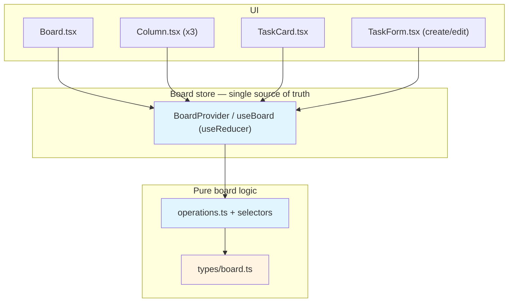
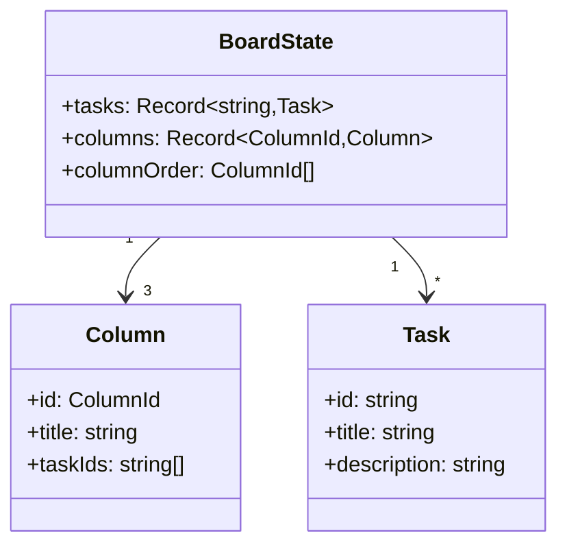
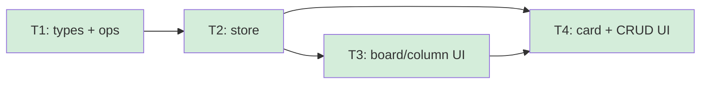

# Kanban Board & Task CRUD - Overview

## Spec Reference

[Spec](../spec/spec.md) · [Requirement](../spec/requirement.md)

## Problem + Solution

- The demo needs a populated, ordered board and inline task CRUD that updates instantly — and a clean data foundation the other features can extend.
- Solution: a normalized `BoardState` (tasks keyed by id; columns hold ordered `taskIds`), a set of pure board operations, a `BoardProvider`/`useBoard` store as the single source of truth, and the Board/Column/TaskCard UI.
- Technical approach: React + TypeScript functional components; `useReducer`-backed context; pure ops unit-tested with Vitest; UI tested with RTL. Follows project skills `create-component` / `create-service`.
- Deliverable: a working 3-column board with create/edit/delete, ready for `drag-and-drop` (adds MOVE_TASK) and `persistence-seed` (supplies initialState + auto-save) to layer on.

## Architecture Diagram

## Data Model

New types (no DB — in-memory normalized state). See spec.md for the authoritative source.

## Task Index

| Task | File | Description | Dependencies |
|------|------|-------------|--------------|
| T1 | [01-plan-01-board-types-and-operations.md](./01-plan-01-board-types-and-operations.md) | Shared types + pure board operations & selectors | None |
| T2 | [01-plan-02-board-store-context.md](./01-plan-02-board-store-context.md) | `BoardProvider` / `useBoard` reducer store | T1 |
| T3 | [01-plan-03-board-and-column-rendering.md](./01-plan-03-board-and-column-rendering.md) | Board + Column rendering (order, titles, counts) | T2 |
| T4 | [01-plan-04-task-card-and-crud-ui.md](./01-plan-04-task-card-and-crud-ui.md) | TaskCard + create/edit/delete UI | T2, T3 |

## Dependency Graph

