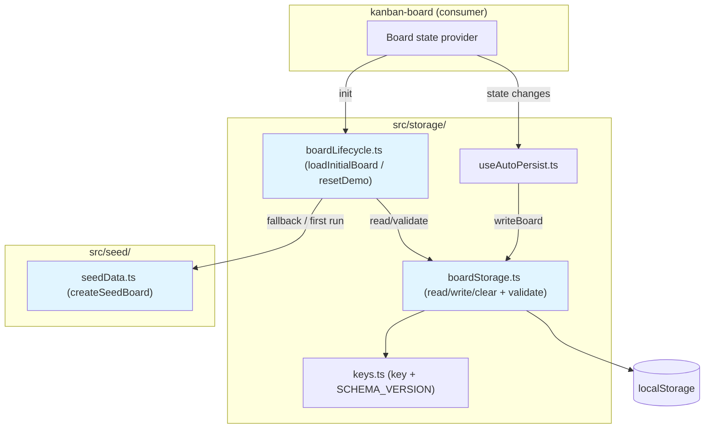
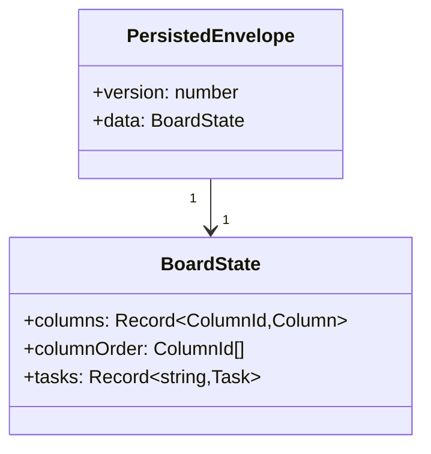
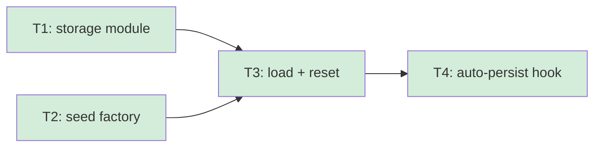

# Persistence & Demo Seed Data - Overview

## Spec Reference

[Spec](../spec/spec.md) · [Requirement](../spec/requirement.md)

## Problem + Solution

- The demo has no backend, yet must keep every change across reloads and look full on first open — without manual saving or crashing on bad data.
- Solution: a single `localStorage` gateway (`src/storage/`) plus a deterministic seed factory (`src/seed/`) wired together by a load-or-seed lifecycle and an auto-persist hook.
- Key technical approach: versioned envelope `{ version, data }` at one namespaced key; safe parse + structural validation; corrupt/missing → seed fallback; write-through on every state change.
- Output: durable board state, believable first-run seed, and a Reset demo action — all client-side.

## Architecture Diagram

## Data Model

No new persisted DB entities. `BoardState` is consumed from `kanban-board`
(`src/types/board.ts`); this feature serializes it inside a versioned envelope.

## Task Index

| Task | File | Description | Dependencies |
|------|------|-------------|--------------|
| T1 | [01-plan-01-storage-module.md](./01-plan-01-storage-module.md) | Single `localStorage` gateway: keys, versioned envelope, read/write/clear, validation | None (consumes `BoardState`) |
| T2 | [01-plan-02-seed-factory.md](./01-plan-02-seed-factory.md) | Deterministic demo seed: 3 columns + realistic tasks | None (consumes `BoardState`) |
| T3 | [01-plan-03-load-and-reset.md](./01-plan-03-load-and-reset.md) | `loadInitialBoard` (load-or-seed, persist seed) + `resetDemo` | T1, T2 |
| T4 | [01-plan-04-auto-persist.md](./01-plan-04-auto-persist.md) | `useAutoPersist` hook + Reset demo binding (seam to board provider) | T3 |

## Dependency Graph

