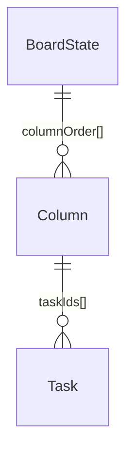
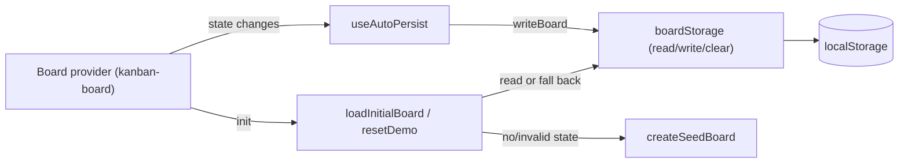

# Persistence & Demo Seed Data — Software Design Document

## Source

Business rules (BR-xxx), acceptance criteria (AC-xxx), and NFRs live in
[requirement.md](./requirement.md). This SDD is the engineering contract.

---

## Intention

Give the Kanban demo durable, zero-setup state: every board change auto-saves to
`localStorage`, reloads restore it exactly, and any missing/corrupt state falls back
to believable demo seed data so the board is never empty and never crashes. A single
persistence module is the only `localStorage` gateway; a deterministic seed factory
feeds first-run and Reset demo.

---

## Use Cases

Detailed scenarios in [use-cases.md](./use-cases.md).

| Use Case | Description | AC refs |
|----------|-------------|---------|
| [UC-01 — First load seeds the board](./use-cases.md#uc-01--first-load-seeds-the-board-us-01) | No saved state → seed renders | AC-003, AC-006, AC-007 |
| [UC-02 — Change auto-saves and restores](./use-cases.md#uc-02--change-auto-saves-and-restores-us-02) | Mutate → reload → exact restore | AC-001, AC-002, AC-008 |
| [UC-03 — Corrupt state degrades to seed](./use-cases.md#uc-03--corrupt-state-degrades-to-seed-us-03) | Bad storage → seed fallback | AC-004 |
| [UC-04 — Reset demo](./use-cases.md#uc-04--reset-demo-us-04) | Clear + re-seed original | AC-009 |

---

## Technical Requirements

| ID | Category | Requirement |
|----|----------|-------------|
| NFR-T01 | Boundary | Only `src/storage/` calls the `localStorage` Web API; all other code uses its exported functions. |
| NFR-T02 | Coverage | Storage + seed + lifecycle modules reach ≥ 90% branch coverage (pure, deterministic logic). |
| NFR-T03 | Determinism | `createSeedBoard()` uses no `Date.now()`, `Math.random()`, or `crypto` — stable literal ids only. |
| NFR-T04 | Safety | A throwing `localStorage` (quota/private mode) must not crash the app; writes degrade silently. |

---

## Test Cases

Given/When/Then; each references an AC. Tag = verifiability type.

### TC-001 — Round-trip restore (AC-001, BR-001) [UNIT]
**Given** a valid `BoardState` written via `writeBoard`
**When** `readBoard()` is called
**Then** it returns a value deeply equal to what was written.

### TC-002 — Versioned, namespaced envelope (BR-001) [UNIT]
**Given** a board written via `writeBoard`
**When** the raw `localStorage` value at `kanban-demo:board` is parsed
**Then** it is `{ version: SCHEMA_VERSION, data: <board> }`.

### TC-003 — Missing key → null (AC-003) [UNIT]
**Given** no `kanban-demo:board` key
**When** `readBoard()` runs **Then** it returns `null` (caller will seed).

### TC-004 — Unparseable JSON → null (AC-004, FR-P4) [UNIT]
**Given** the key holds `"{not json"`
**When** `readBoard()` runs **Then** it returns `null` and does not throw.

### TC-005 — Version mismatch → null (AC-004, FR-P4) [UNIT]
**Given** a stored envelope with `version: 999`
**When** `readBoard()` runs **Then** it returns `null`.

### TC-006 — Structurally invalid → null (AC-004, FR-P4) [UNIT]
**Given** a stored envelope whose `data` has a `columnOrder` id missing from `columns`, or a `taskId` with no matching task
**When** `readBoard()` runs **Then** it returns `null`.

### TC-007 — Validation guard (BR-004, BR-011) [UNIT]
**Given** assorted inputs **When** `isValidBoardState(x)` runs
**Then** it returns `true` only for a well-formed board where every task appears in exactly one column's `taskIds`.

### TC-008 — Seed shape (AC-006, AC-007) [UNIT]
**Given** `createSeedBoard()` **When** inspected
**Then** columns are To Do / In Progress / Done in order, ≥6 tasks, ≥1 per column, each task in exactly one column.

### TC-009 — Seed content (AC-007, BR-007) [UNIT]
**Given** the seed **When** each task is checked **Then** title and description are both non-empty strings.

### TC-010 — Seed determinism (AC-010, BR-008) [UNIT]
**Given** two `createSeedBoard()` calls **Then** the results are deeply equal.

### TC-011 — First load seeds and persists (AC-003, DD-1) [UNIT]
**Given** empty storage **When** `loadInitialBoard()` runs
**Then** it returns `{ source: 'seeded', state }` equal to the seed, and the seed is now persisted.

### TC-012 — Saved state wins over seed (AC-008, DD-5) [UNIT]
**Given** valid saved state differing from the seed **When** `loadInitialBoard()` runs
**Then** it returns `{ source: 'restored', state }` equal to the saved state; the seed is NOT applied.

### TC-013 — Corrupt load falls back to seed (AC-004, FR-P4) [UNIT]
**Given** corrupt saved state **When** `loadInitialBoard()` runs
**Then** it returns `{ source: 'seeded', state }` and never throws or returns empty.

### TC-014 — Reset demo (AC-009, DD-4) [UNIT]
**Given** modified saved state **When** `resetDemo()` runs
**Then** storage is cleared then overwritten with a fresh seed deep-equal to `createSeedBoard()`, which is returned.

### TC-015 — Auto-persist on change (AC-002, FR-P2) [UNIT]
**Given** `useAutoPersist(state)` mounted **When** `state` changes
**Then** `writeBoard` is called with the new state (no manual save).

### TC-016 — Quota/throwing storage degrades (NFR-T04, NFR-4) [UNIT]
**Given** `localStorage.setItem` throws **When** a write occurs **Then** no exception propagates to the app.

### TC-017 — Reload simulation end-to-end (AC-001, AC-008) [INTEGRATION]
**Given** seed → mutate → write **When** a fresh `loadInitialBoard()` runs (new "session")
**Then** the restored state equals the mutated state.

---

## Architecture

### Tradeoffs

| Tradeoff | We chose | Over | Rationale |
|----------|----------|------|-----------|
| Migrations vs. simplicity | Version bump ⇒ reseed | Schema migration code | Demo data is disposable; FR-P4 fallback already covers version drift |
| Persist seed on first load vs. lazy | Persist immediately | Wait for first user change | Makes "saved state exists" true after first render; reset/restore stay consistent (still identical to lazy until a change) |
| Write-through vs. debounce | Synchronous write on each change | Debounced batch | Board is tiny (≈3 cols / 10–20 tasks); simplicity + guaranteed durability (NFR-4) beat micro-optimization |

### Data Model

`BoardState` is **owned by `kanban-board`** (`src/types/board.ts`) and consumed here.
Normalized shape (tasks keyed by id; columns hold ordered `taskIds`):

| Entity | Key Fields | Notes |
|--------|-----------|-------|
| BoardState | `columns: Record<ColumnId,Column>`, `columnOrder: ColumnId[]`, `tasks: Record<string,Task>` | Single source of truth |
| Column | `id`, `title`, `taskIds: string[]` | Fixed: todo / in-progress / done |
| Task | `id`, `title`, `description`, `columnId` | Belongs to exactly one column |

**Persisted envelope:** `{ version: number; data: BoardState }` at key `kanban-demo:board`.

### Service Integrations

